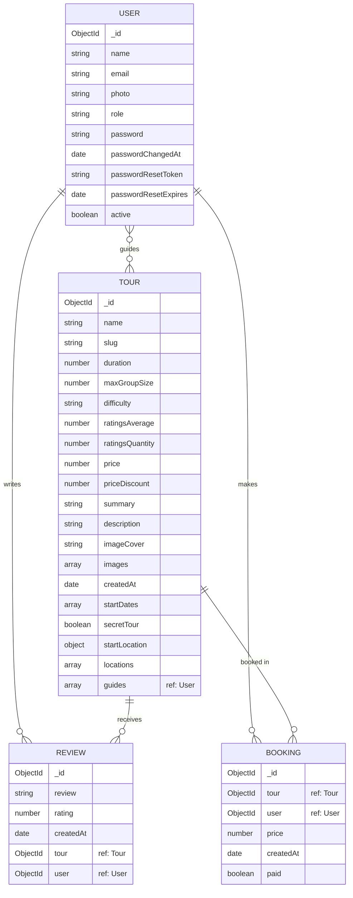

# 🏞️ Natours Application

> Built using modern technologies: **Node.js, Express, MongoDB, Mongoose** and friends 😁

A full-featured tour booking platform — browse tours, leave reviews, book trips with Stripe, upload photos, receive emails, and manage everything through a secure, production-hardened REST API.


🔗 **Live Demo:** [natours-2025-practice.vercel.app](https://natours-2025-practice.vercel.app/)

---

## 🛠️ Tech Stack

### Core


### Views


### Auth & Security


### Payments & Media


### Utilities & Middleware


### Dev Tooling


---

## ✨ Features

- 🔐 **Authentication & Authorization** — JWT-based signup/login, password reset via email, role-based access control (`user`, `guide`, `lead-guide`, `admin`)
- 🗺️ **Tours** — full CRUD, geospatial queries (`2dsphere` index) for `startLocation` and tours-within-radius/distance, aggregation pipeline stats
- ⭐ **Reviews & Ratings** — one review per user per tour (compound unique index), automatic average rating recalculation via static methods + query middleware
- 💳 **Bookings & Payments** — Stripe Checkout integration, booking creation on successful payment
- 🖼️ **Image Uploads** — Multer + Sharp for tour images, user photos, and multi-image resizing
- ✉️ **Email** — Nodemailer for account emails and password resets
- 🛡️ **Security Hardening** — Helmet, rate limiting, data sanitization (NoSQL injection & XSS), parameter pollution protection, CORS
- 🖥️ **Server-side Rendered Views** — Pug templates for the browsable frontend, bundled with Parcel

---

## 🗂️ Data Model (ERD)



**Relationship notes:**

- A **Tour** can have many **Reviews** (virtual populate — not stored on the Tour document) and many **Bookings**.
- A **User** can write many **Reviews** and make many **Bookings**.
- A **Review** requires exactly one `tour` and one `user`, enforced with a compound unique index (`{ tour: 1, user: 1 }`) to prevent duplicate reviews.
- A **Tour**'s `guides` field references multiple **Users** (embedded array of ObjectIds, auto-populated via query middleware, excluding `__v` and `passwordChangedAt`).
- **Booking** documents auto-populate both `user` and `tour` (name only) on find.

---

## 🚀 Getting Started

### Prerequisites

- Node.js `^22`
- A MongoDB connection string (local or Atlas)

### Installation

```bash
git clone https://github.com/theubaidistan/natours.git
cd natours
npm install
```

### Environment Variables

Create a `.env` file in the root directory:

```env
NODE_ENV=development
PORT=3000
DATABASE=<your-mongodb-connection-string>
DATABASE_PASSWORD=<your-db-password>

JWT_SECRET=<your-jwt-secret>
JWT_EXPIRES_IN=90d
JWT_COOKIE_EXPIRES_IN=90

EMAIL_USERNAME=<mailtrap-or-smtp-username>
EMAIL_PASSWORD=<smtp-password>
EMAIL_HOST=<smtp-host>
EMAIL_PORT=<smtp-port>

STRIPE_SECRET_KEY=<your-stripe-secret-key>
STRIPE_WEBHOOK_SECRET=<your-stripe-webhook-secret>
```

### Available Scripts

| Command              | Description                                |
| -------------------- | ------------------------------------------ |
| `npm run dev`        | Start server with nodemon (development)    |
| `npm run start:dev`  | Start in development mode with `cross-env` |
| `npm run start:prod` | Start in production mode                   |
| `npm run debug`      | Debug with `ndb`                           |
| `npm run watch:js`   | Watch & bundle frontend JS with Parcel     |
| `npm run build:js`   | Production build of frontend JS bundle     |
| `npm run import`     | Import seed/dev data into the database     |
| `npm run delete`     | Delete all data from the database          |
| `npm run lint`       | Lint and auto-fix with ESLint              |

---

## 📁 Project Structure (Models)

```
models/
├── tourModel.js     # Tours: geospatial data, virtual populate, slug generation
├── userModel.js     # Users: password hashing, reset tokens, soft-delete filter
├── reviewModel.js   # Reviews: rating aggregation, unique per tour/user
└── bookingModel.js  # Bookings: Stripe-linked tour purchases
```

---

## 📄 License

ISC
