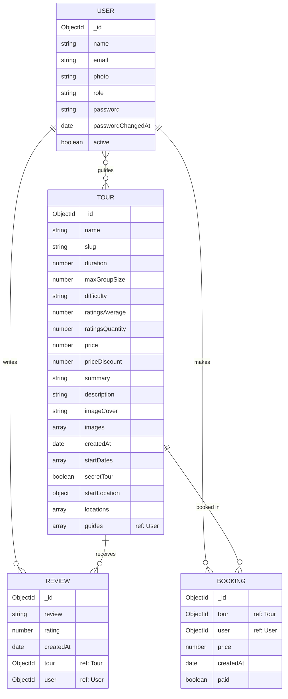

# 🏞️ Natours Application

Built using modern technologies: **Node.js, Express, MongoDB, Mongoose** and friends 😁

A full-featured tour booking platform — browse tours, leave reviews, book trips with Stripe, and manage everything through a secure REST API.

🔗 **Live Demo:** [natours-2025-practice.vercel.app](https://natours-2025-practice.vercel.app/)

---

## 🛠️ Built With

---

## 🗂️ Data Model (ERD)

**Relationship notes:**

- A **Tour** can have many **Reviews** (virtual populate) and many **Bookings**.
- A **User** can write many **Reviews** and make many **Bookings**.
- A **Review** requires exactly one `tour` and one `user` (compound unique index prevents duplicate reviews per user/tour).
- A **Tour**'s `guides` field references multiple **Users** (embedded array of ObjectIds, populated on find).

---

## 📄 License

ISC
